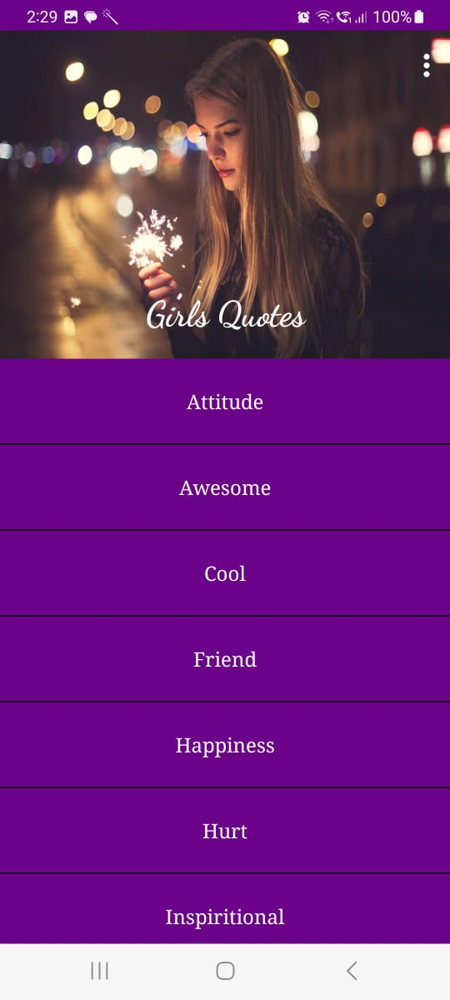
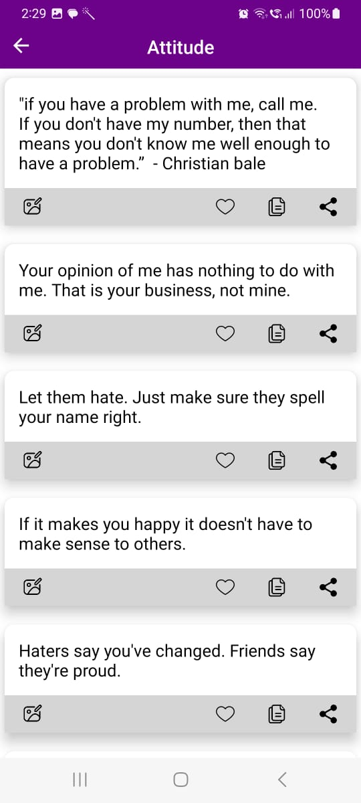
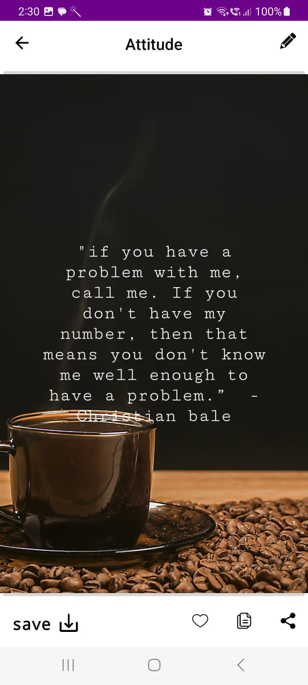
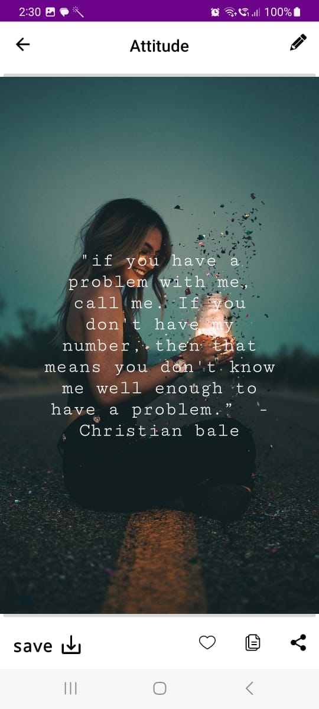
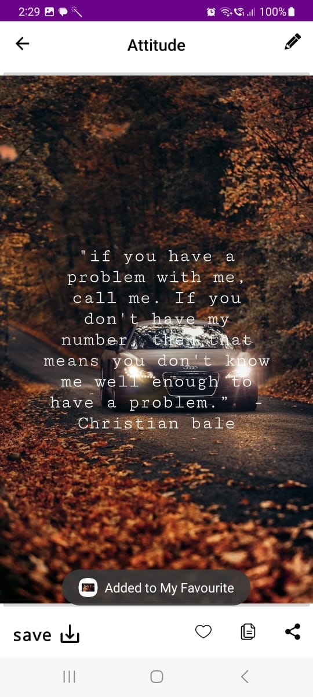

# Girls Quote App

This repository contains the code for a Girls Quote App, designed to inspire and uplift with a collection of empowering quotes for girls.

## Features

- **Inspiring Quotes:** Curated collection of motivational and empowering quotes for girls.
- **Interactive UI:** User-friendly interface for a seamless experience.
- **Functionality:**
  - **Like:** Express appreciation for quotes by liking them.
  - **Share:** Share your favorite quotes with friends and on social media.
  - **Save:** Save quotes to access them later or create a personal collection
 

## Screenshots
<div align="center">
  
  
  
  
  
  
</div>


## Getting Started

### Prerequisites

- Ensure you have [Node.js](https://nodejs.org/) installed on your machine.

### Installation

1. Clone the repository:

   ```bash
   https://github.com/ShiroyaShubham/Girls-Quotes-App.git
